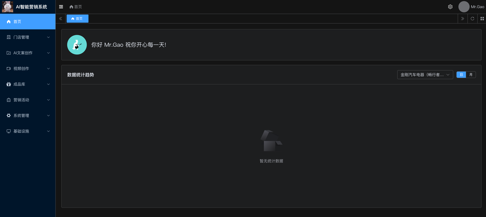
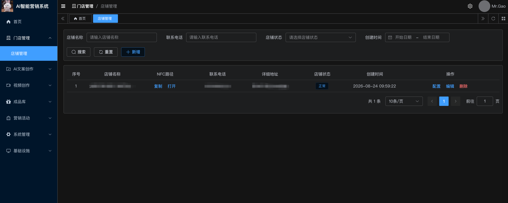
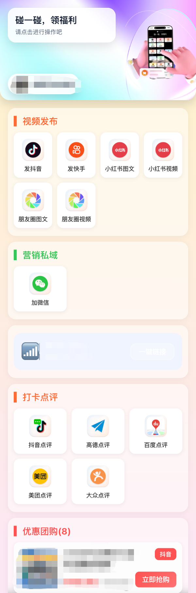
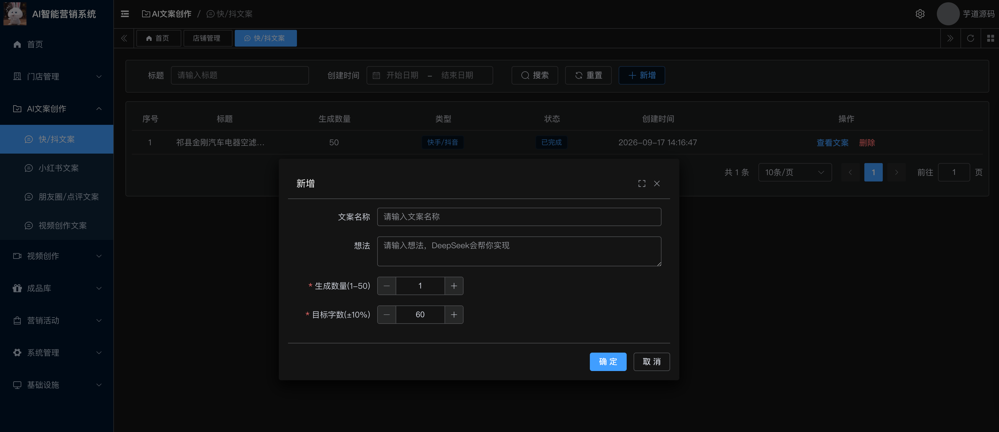
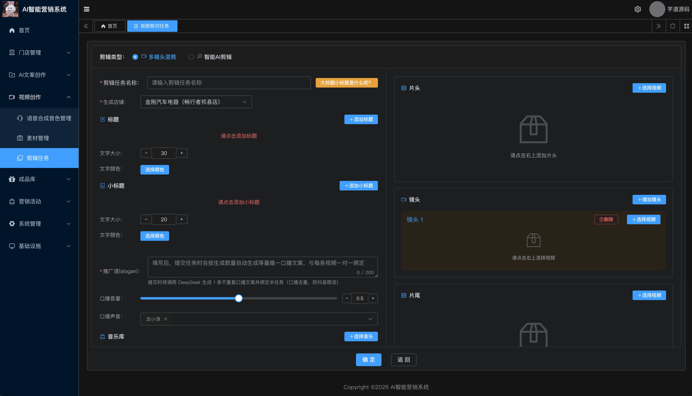
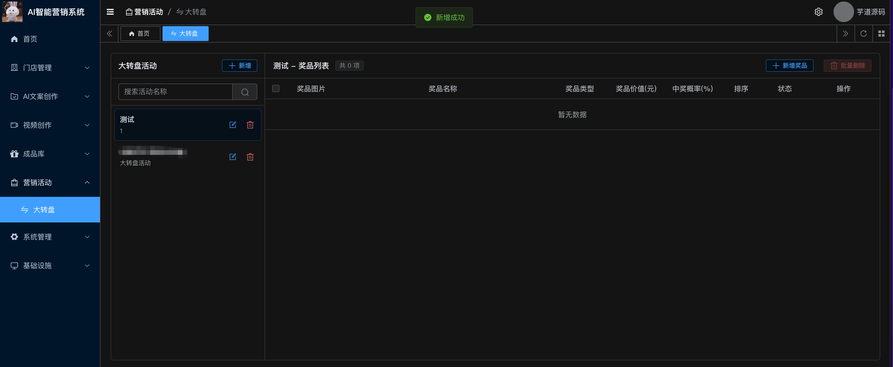

# NFC 碰一碰智能营销系统

> 一套面向线下门店的「碰一碰」NFC 智能营销系统：顾客用手机碰一下 NFC 卡片，即可自动打开营销页面，一键发布短视频、生成文案、引流私域、参与抽奖，帮门店快速获客引流。

适用场景：餐饮、美业、教培、零售、健身、本地生活服务等各类线下门店。

---

## 一、核心业务流程

```
线下场景：
顾客进店 → 扫描二维码/NFC标签 → 跳转小程序活动中心
→ 选择营销动作（发视频/点评/加微信/领团购）
→ 一键发布到各大平台 → 自动带上门店位置和话题
→ 实现病毒式传播 → 为门店引流拓客

商家场景：
注册商家账号 → 配置门店信息和各平台POI
→ 上传视频素材 → AI生成混剪视频
→ 创建分享二维码/NFC标签 → 印刷到店面
→ 用户扫码分享 → 查看数据统计
```

---

## 二、爆店码：多平台视频分发

**什么是爆店码？**

爆店码是一种基于二维码的智能营销工具，用户扫码后可一键将商家准备好的视频发布到抖音、快手、小红书等短视频平台，视频会自动带上门店 POI（位置）和话题标签，实现病毒式传播。

**与传统二维码的区别：**

| 对比项   | 传统爆店码       | 碰一碰爆店码            |
| -------- | ---------------- | ----------------------- |
| 操作方式 | 扫码             | 手机靠近                |
| 平台支持 | 仅抖音           | 抖音/快手/小红书/视频号 |
| 参与率   | 20-30%           | 40-60%                  |
| 用户体验 | 需打开摄像头扫码 | 0 操作，靠近即可        |

**支持的分享平台：**

- ✅ 抖音（自动带 POI + 话题标签）
- ✅ 快手（OAuth 授权发布）
- ✅ 小红书（笔记 + 视频）
- ✅ 微信视频号
- ✅ 朋友圈（图文分享）

---

## 三、核心卖点

- **碰一碰即达**：顾客手机碰 NFC 卡片，自动弹出门店专属营销页（手机端 H5），无需下载 App。
- **AI 一键文案**：接入 DeepSeek 大模型，一键生成抖音 / 快手 / 小红书 / 朋友圈 / 视频号多平台文案，告别手动写。
- **视频混剪**：素材拼接、配音、字幕，通过 FFmpeg 合成 1080P 视频，无需剪辑师。
- **TTS 语音合成**：内置 Kokoro TTS（本地部署，中文女声 / 男声多音色）与 Edge TTS 双方案，自动给视频配音。
- **多平台分发**：打通抖音、快手、小红书开放平台，碰一碰后可直接跳转 App 发视频。
- **私域引流**：碰一碰即可展示企微 / 微信群 / 公众号二维码，沉淀门店私域。
- **转盘抽奖**：内置大转盘抽奖营销玩法，奖品 / 概率后台可配，活跃门店客流。
- **门店管理**：多门店管理、WiFi 配置、二维码配置、图文发布配置、页面配色一站式后台。
- **数据统计**：每日视频转发数、剩余视频 / 文案额度、抽奖使用量、中奖量自动统计。
- **微信兼容**：手机端页面专门处理微信浏览器环境，识别后引导跳系统浏览器，保障抖音等 App 正常唤起。

---

## 四、核心优势

### 技术优势

1. **NFC 技术创新** - 比传统二维码转化率提升 50%+，用户体验更流畅
2. **多平台集成** - 打通抖音、快手、小红书、美团、高德等主流平台
3. **AI 加持** - AI 文案生成 + 视频混剪（素材拼接、转场、配音配乐）
4. **异步任务处理** - 消息队列 + 定时任务，不阻塞用户操作
5. **完整的权限体系** - RBAC + 多租户权限架构，精细化控制
6. **多端统一** - 管理后台 + 手机碰一碰 H5，一套后台多端覆盖

### 商业优势

1. **降低营销门槛** - 商家无需专业运营人员，系统自动化完成
2. **提高转化效率** - NFC 碰一碰参与率 40-60%，远超扫码 20-30%
3. **精准引流** - 自动带 POI 和话题，视频种草效果显著
4. **多渠道覆盖** - 一次配置，多平台分发，覆盖更广
5. **数据可追踪** - 统计每个活动的参与数、分享数、转化数

### 行业适用性

✅ **餐饮行业**：火锅、烧烤、奶茶、咖啡、快餐等
✅ **零售行业**：服装、鞋帽、数码、化妆品等
✅ **美业**：美容、美发、美甲、纹绣等
✅ **娱乐休闲**：KTV、影院、健身房、密室逃脱等
✅ **生活服务**：超市、便利店、洗车、维修等

---

## 五、功能清单

### 1. 碰一碰手机端（独立 H5 项目 `phone-preview`）

顾客碰 NFC 后打开的页面，模块化配置，后台开关控制：

- 头部 Hero 区：背景图、营销标题、营销文案、门店 Logo
- 视频发布区：抖音 / 快手 / 小红书 / 视频号一键跳转发布
- 营销私域区：企微 / 群 / 公众号二维码扫码引流
- WiFi 区：一键展示门店 WiFi 名称与密码
- 转盘抽奖区：碰一碰即可抽奖

### 2. 后台管理端（Vue3 + Element Plus）

#### 门店与配置
- 门店管理：多门店信息、Logo、背景图管理
- 门店配置：WiFi、二维码、平台账号、图文发布、购买、页面配色、评价等全配置
- 门店购买管理

#### 内容与素材
- 素材管理：图片 / 视频 / 音频素材库，支持分类
- 媒体文件 / 媒体组：素材打包分组，便于视频拼接
- 话题库 / 话题项：维护抖音等平台热门话题，自动带话题发布

#### AI 智能生成
- 文案管理：抖音快手、小红书、朋友圈、视频文案、业务文案多场景
- 文案列表：批量管理 AI 生成的文案
- 语音音色：TTS 音色管理，支持 Kokoro / Edge 双引擎

#### 视频混剪
- 混剪任务：剪辑任务 + 剪辑项，素材拼接、配音、字幕合成 1080P 视频

#### 营销玩法
- 转盘管理：抽奖转盘配置
- 转盘奖品：奖品、图片、概率、库存管理

#### 数据
- 每日统计：视频转发数、剩余视频额度、剩余文案额度、抽奖使用量、中奖量

## 六、技术栈

| 分类 | 技术 |
| --- | --- |
| 后端框架 | Java 17 + Spring Boot 3.5 + MyBatis Plus |
| 数据库 | MySQL 5.7 / 8.0+ |
| 缓存与队列 | Redis + Redisson |
| 管理后台前端 | Vue3 + Element Plus + Vite + TypeScript + Pinia |
| 手机碰一碰页 | 独立 Vue3 + Vite 轻量项目 |
| AI 文案 | DeepSeek 大模型 API |
| 视频混剪 | FFmpeg 本地剪辑合成 |
| 语音合成 | Kokoro TTS（本地 Python 服务，多中文音色）+ Edge TTS |
| 对象存储 | 阿里云 OSS + CDN |
| 多平台开放 | 抖音开放平台、快手开放平台、小红书开放平台 |
---

## 七、项目结构

```
ayqu-nfc-java
├── nfc-server                   # 后端启动模块（管理后台 + 用户端 API）
├── nfc-module-system             # 系统功能模块（用户/角色/菜单/租户等）
├── nfc-module-infra              # 基础设施模块（代码生成/文件/任务/日志等）
├── nfc-module-member             # 会员中心模块
├── nfc-module-douyin             # 抖音营销业务模块（门店/视频/文案/抽奖等核心业务）
├── nfc-framework                 # 框架封装
│   ├── nfc-spring-boot-starter-deepseek      # DeepSeek 大模型封装
│   ├── nfc-spring-boot-starter-kokoro-tts   # Kokoro TTS 封装
│   ├── nfc-spring-boot-starter-edge-tts      # Edge TTS 封装
│   ├── nfc-spring-boot-starter-ffmpeg        # FFmpeg 视频混剪封装
│   ├── nfc-spring-boot-starter-ice           # 云端智能媒体服务封装
│   ├── nfc-spring-boot-starter-oss           # 阿里云 OSS 封装
│   ├── nfc-spring-boot-starter-speech        # 语音合成统一封装
│   └── ...                                   # 其余 web/security/mq/job 等基础封装
├── nfc-kokorotts                  # Kokoro TTS Python 服务（含 8 套中文音色文件）
├── nfc-ui                         # 管理后台前端（Vue3 + Element Plus）
├── phone-preview                  # 碰一碰手机端 H5（独立轻量项目）
└── nfc-dependencies               # 依赖版本统一管理
```

---

## 八、演示截图

### 1. 管理后台首页



### 2. 门店管理 - 门店列表



### 3. 门店配置 - 碰一碰页面配置


### 4. 碰一碰手机端页面（phone-preview）



### 5. AI 文案生成



### 6. 视频混剪任务



### 7. 转盘抽奖配置



---

## 九、快速部署

### 1. 环境要求

- JDK 17+
- Maven 3.9+
- MySQL 5.7 / 8.0+
- Redis 5.0+
- Node.js 20+、pnpm 8.6+
- Python 3.10+（用于 Kokoro TTS）
- FFmpeg（加入 PATH）

### 2. 后端启动

```bash
# 1. 导入数据库（建库后执行 SQL 脚本）
# 2. 修改 nfc-server/src/main/resources/application-local.yaml 中的数据库、Redis、OSS、DeepSeek、抖音等配置
# 3. 编译启动
mvn clean install -DskipTests
cd nfc-server && mvn spring-boot:run
```

后端默认端口 `:48080`，接口文档：`http://localhost:48080/swagger-ui`

### 3. 管理后台前端启动

```bash
cd nfc-ui
pnpm install
pnpm dev
```

### 4. 碰一碰手机端启动

```bash
cd phone-preview
npm install
npm run dev
```

### 5. Kokoro TTS 服务启动（可选，视频配音需要）

```bash
cd nfc-kokorotts
bash setup.sh       # 首次安装依赖
bash start.sh       # 启动服务，默认端口 8880
```

### 6. 关键配置说明

- `application-local.yaml`：数据库、Redis、OSS、DeepSeek、抖音 / 快手 / 小红书开放平台 key
- `nfc.douyin.key` / `nfc.kuaishou.key` / `nfc.xiaohongshu.key`：多平台开放平台凭证
- `nfc.deepseek.api-key`：DeepSeek API Key（用于 AI 文案生成）
- `nfc.kokoro-tts.endpoint`：Kokoro TTS 服务地址（默认 `http://localhost:8880`）
- `nfc.ffmpeg.ffmpeg-path`：FFmpeg 可执行文件路径

---

## 十、购买与咨询

本项目为商业源码，购买后提供完整源码 + 部署文档 + 技术答疑。

- **微信咨询**：`Gao_Lianjie`（添加请备注：NFC 项目咨询）
- **交流语言**：中文

> 购买即视为同意不二次公开售卖源码。功能定制、二次开发可微信沟通。

---

## 十一、常见问题

**Q：NFC 卡片需要自己买吗？**
A：硬件 NFC 卡片需自行采购（普通 Ntag215 / Ntag213 即可），后台绑定卡片跳转链接即可使用。

**Q：抖音 / 快手 / 小红书发布需要申请吗？**
A：需要在对应开放平台注册开发者账号并申请相关权限，审核通过后填入后台配置即可。

**Q：支持二次开发吗？**
A：支持。代码结构清晰、模块化、注释完整，提供部署文档，可自行或委托我们二次开发。
